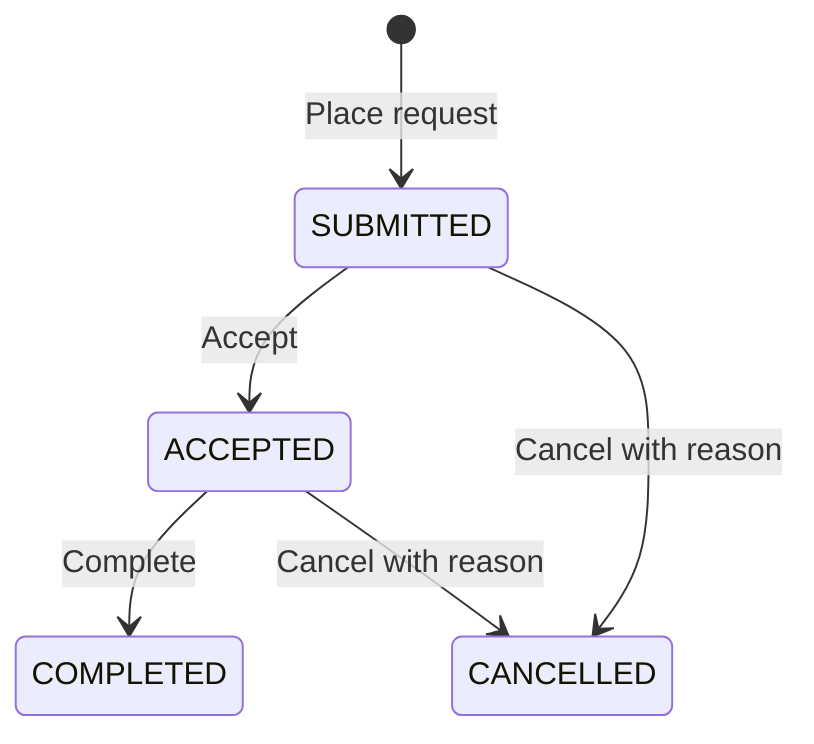

# The Quiet Shelf API — order workflow

> **Status:** Proposed. **Date:** 2026-10-07. No workflow code or migration has been implemented.

## Goal

Let Staff and Admin process new order requests, let customers follow their own
requests, and preserve correct stock and historical prices. Coordinate with
[the frontend specification](../../../frontend/specs/order-workflow/SPEC.md).
Current behavior remains governed by [the root specification](../../SPEC.md),
[Staff permissions](../staff/SPEC.md), and [Activity](../activity/SPEC.md).

## Scope and decisions

- New requests start as Submitted; Staff and Admin may accept, complete, or cancel.
- Customer order details expose current status and a read-only status timeline.
- Staff/Admin can filter order lists and see the responsible person and time.
- Admin Activity records workflow changes; cancellation records restored book stock.
- No payment, refunds, shipping, email notifications, customer cancellation,
  edits to saved order lines, reopening, bulk actions, or configurable workflow.
- **Agreed local data policy:** existing development data may be deleted. Introduce
  this feature with a fresh local database and reseed sample books and demo accounts.
  Old orders, custom catalog edits, accounts, sessions, and Activity are discarded.
  No legacy-order state, preservation, or compatibility UI is required.
- Cancellation requires a trimmed, customer-visible reason of 1–500 characters.
  Staff and Admin may process every new request; no assignment or ownership system.
- Completed means the store finished handling the request. It asserts neither
  payment nor delivery.

## States and transitions



Completed and Cancelled are terminal. Submitted cannot move directly to Completed.
Every order has a non-null workflow status. Repeating the current desired status is a
no-op returning current details, with no new timeline, Activity, or stock write.
The original cancellation reason remains unchanged on a repeated cancellation.

## Permissions and privacy

- Add server-owned `PROCESS_ORDERS` to Staff and Admin in the existing permission
  map. Retain `VIEW_ORDERS` for list/detail and Admin-only `VIEW_ACTIVITY`.
- Check permission before validation or order lookup. Guests receive
  `UNAUTHENTICATED`; Customers receive `FORBIDDEN` on processing/workspace APIs.
- `myOrder` requires a session and matches both order ID and session user ID.
  A valid missing or another user's order returns null without disclosure.
  Customer identity is never supplied by the caller or matched by email.
- An account of any role may view its own customer-facing order detail.
- Customer timeline exposes statuses, timestamps, and cancellation reason only.
  Staff/Admin attribution is available through workspace detail and Admin Activity;
  customer reads do not expose staff IDs, names, roles, or general Activity records.

## Proposed GraphQL contract

These definitions are additions/changes to `src/modules/orders/order.schema.ts`,
not a second schema. Existing fields retain their names and behavior.

```graphql
enum OrderStatus { SUBMITTED ACCEPTED COMPLETED CANCELLED }
enum OrderStatusFilter { ALL SUBMITTED ACCEPTED COMPLETED CANCELLED }

type OrderStatusEvent {
  id: ID!
  fromStatus: OrderStatus
  toStatus: OrderStatus!
  createdAt: String!
  cancellationReason: String
}
type AdminOrderStatusEvent {
  id: ID!
  fromStatus: OrderStatus
  toStatus: OrderStatus!
  createdAt: String!
  cancellationReason: String
  actorName: String!
  actorRole: UserRole!
}
type MyOrder {
  id: ID!
  createdAt: String!
  totalCents: Int!
  items: [OrderItem!]!
  status: OrderStatus!
  history: [OrderStatusEvent!]!
}
input SetOrderStatusInput {
  id: ID!
  expectedStatus: OrderStatus!
  status: OrderStatus!
  cancellationReason: String
}

extend type Query {
  myOrder(id: ID!): MyOrder
}
extend type Mutation {
  setOrderStatus(input: SetOrderStatusInput!): AdminOrder!
}
```

- Add non-null `status: OrderStatus!` to OrderReceipt, OrderHistoryEntry, and
  AdminOrder. New receipts return SUBMITTED.
- Add `history: [AdminOrderStatusEvent!]!` to AdminOrder, resolved only when requested.
  Order list operations should omit histories.
- Extend existing `adminOrders` with `status: OrderStatusFilter = ALL`, preserving
  limit/offset defaults and limits. Filter before counting and pagination; retain
  newest-first ordering by createdAt then ID. ALL includes all four statuses.
- Histories are oldest-first by event ID and complete. At most three events are
  possible for a request: submission and allowed transitions; do not add a generic
  history paging subsystem. Each request begins with a real submission event.
- IDs use existing strict positive safe-integer workspace ID validation. Malformed
  IDs/input return BAD_USER_INPUT. Valid missing mutation targets return BAD_USER_INPUT.
- For a real change, stored status must equal expectedStatus and the transition
  must be allowed. A stale expectedStatus returns `CONFLICT`, with no write.
  An invalid transition returns BAD_USER_INPUT.
- Validate cancellationReason before execution: required for CANCELLED, forbidden
  for other target statuses; unknown enums fail GraphQL validation.
- Evaluate current-status no-op before comparing expectedStatus, after validating
  the input and permissions. This makes retries safe without adding a request-key table.

## Persistence and migration

- Add non-null `orders.status`, constrained to the four enum values and defaulting
  to SUBMITTED. New order writes explicitly set SUBMITTED and create their initial
  event. Only the fresh-database migration path is supported for this feature;
  do not upgrade a populated old database by inventing statuses or history.
- Add `order_status_events`: integer primary key, non-null order FK, nullable
  from_status, non-null to_status, UTC created_at, nullable cancellation_reason,
  nullable actor_user_id with ON DELETE SET NULL, non-null actor_name and actor_role
  snapshots. Apply enum checks and an `(order_id, id)` index. Reuse existing user FK
  and role conventions; deleting an actor must not erase attribution snapshots.
- Record initial null→SUBMITTED event in the existing place-order transaction using
  authenticated server attribution; creation failure rolls back stock/order/history.
- Once the new workflow is running, preserve request IDs, user links, lines,
  contact snapshots, prices, totals, and createdAt through every transition.
- Define source schema in `src/database/schema.ts`; generate migration SQL/metadata
  through `bun run db:generate`. Do not prescribe a migration number before generation.
- Extend ActivityAction with ORDER_STATUS_CHANGED, ActivityTargetType with ORDER,
  and ActivityField with ORDER_STATUS. Reuse event writer with target name
  `Order request #<id>` and status before/after values; do not put customer email or
  cancellation text into generic Activity details. Update enum/validation consumers.

## Atomic writes and inventory

Execute every real transition within one database transaction. Read current status,
enforce expectedStatus/transition, update status conditionally, insert timeline and
ORDER_STATUS_CHANGED Activity. Failure in any step rolls back all steps.

Cancellation additionally restores the originally saved quantities using stored
order_items.book_id, including archived books. Increment current stock atomically;
do not replace it with an earlier stock value. Record existing BOOK_STOCK_ADJUSTED
Activity with positive delta and actual before/after stock in the same transaction.
If multiple lines reference the same book, aggregate their quantities first.
Missing book references or quantities/stock outside existing supported integer
bounds reject the whole cancellation without changing status or inventory.

Accepting/completing does not change inventory. Serialized/concurrent attempts
must have at most one committed transition and one restoration. If another request
already reached the same target, return current details as a no-op; otherwise return
CONFLICT. Never automatically retry a different business action after conflict.
Cancellation never deletes the order, rewrites snapshots, or unarchives a book.

## Implementation boundaries

- Extend existing order repository/service/validation/types/schema/resolvers and
  admin-order repository/service/resolvers. Preserve current module boundaries.
- Update `admin.authorization.ts`, Activity schema/types/validation, schema source,
  and migration files. Add shared CONFLICT translation where necessary.
- Generate backend resolver types with `bun run codegen`; coordinate frontend
  operations/codegen. Do not edit generated types manually.
- Synchronize implemented order, auth, Staff, Activity, and root documentation only
  after verified delivery; current exclusions remain current until then.

## Acceptance criteria and verification

- [ ] New placement atomically creates Submitted status/history and deducts stock once.
- [ ] Staff/Admin can perform only allowed transitions; Customers/guests cannot.
- [ ] A fresh migrated database is reseeded with sample books and the three demo
      accounts, with no old requests or orphan records retained.
- [ ] Customer details cannot disclose another account's orders or staff attribution.
- [ ] All status filters return correct totals/pages.
- [ ] Cancellation restores quantities once, including archived books and duplicate
      stored lines; repeats/concurrent requests do not double-restock or duplicate events.
- [ ] Inventory/history/Activity failures roll back the entire transition.
- [ ] Current prices and later stock adjustments do not change saved order amounts.
- [ ] Terminal/invalid transitions and stale writes return the specified errors.
- [ ] Status/timeline attribution and Admin Activity remain correct after role/name changes.

Use migration, service/API, permission, owner-isolation, transaction rollback, and
concurrency regressions. Run backend tests/lint/build/codegen and paired browser
journeys for all roles. During local implementation, stop the API before resetting
its configured SQLite database and related journal/WAL files, recreate it through
the migration wrapper, then run `bun run db:seed` and `bun run demo:seed`. Use the
existing configured auth secret; never commit runtime database files. Browser test
fixtures must create orders through the real placement path or explicitly seed a
consistent Submitted order, inventory deduction, and initial event. Clear stale
client sessions, Apollo data, and local cart entries referencing old book IDs.

The reset is an explicit development setup operation, never an automatic startup
behavior or a migration that deletes production data. Existing-data preservation
and production upgrades are out of scope. Stop writers before any local rollback;
reset/reseed against the prior schema and compatible code. Deploy backend/generated
frontend together; new Activity enum values require updated consumers.

## Review decisions

The user approved discarding existing local data on 2026-10-07. Cancellation
reason and terminal/no-reopen rules remain proposed defaults for this first delivery.
Implementation starts only after the paired specs are reviewed and accepted.
